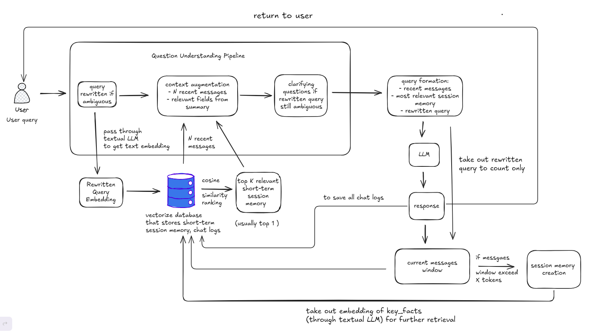

# Chatbot-LLM
**Vulcan Lab – Entrance Exam Project**

## Demo

🎥 **Video Demo (Don't worry, I deleted the API key :3)**:  
[Click here](https://drive.google.com/file/d/1L5SI_t9X-eY8Vvcsb2zcjXdL5SpYurcu/view?usp=sharing)

A modular, memory-augmented chatbot system built with LLMs, structured outputs, and a vector database for long-term conversational context.

---

## Overview

This project implements a **stateful LLM chatbot** with:

- **Structured outputs (JSON Schema–enforced)**
- **Short-term & long-term memory**
- **Context augmentation via vector search**
- **Scalable multi-user / multi-chat architecture**

The system periodically summarizes conversations and stores them in a vector database (Milvus), enabling retrieval and augmentation for future queries.

---

## Architecture Highlights

- **LLM Provider**: Groq API  
- **Vector Database**: Milvus  
- **Memory Types**:
  - **Short-term**: current context window
  - **Long-term**: summarized session memory (vectorized)
- **Core Components**:
  - Query understanding (ambiguity detection, query rewriting)
  - Context augmentation
  - Structured session summarization
  - Grounded answer generation

---

## Workflow



---

## Getting Started

### 1. Prerequisites

- Docker & Docker Compose
- Python 3.10+
- Groq API key

### 2. Start Milvus (Vector Database)

```bash
docker compose up -d
```

### 3. Configure Environment Variables

Create a `.env` file in the project root:

```env
GROQ_API_KEY=your_groq_api_key_here
```

Create a free Groq API key at:  
https://console.groq.com/keys

### 4. Run the Chatbot

```bash
chmod u+x ./run.sh
./run.sh
```

Or run directly:

```bash
python -m src.main --config ./configs/app.yaml
```

---

## Structured Output Examples

### Query Understanding Pipeline

```json
{
  "original_query": "...",
  "is_ambiguous": true,
  "rewritten_query": "...",
  "needed_context_from_memory": [
    "user_profile.prefs",
    "open_questions"
  ],
  "clarifying_questions": [],
  "final_augmented_context": {}
}
```

### Session Memorization

```json
{
  "session_summary": {
    "user_profile": {
      "prefs": [],
      "constraints": []
    },
    "key_facts": [],
    "decisions": [],
    "open_questions": [],
    "todos": []
  },
  "message_range_summarized": {
    "from": 0,
    "to": 42
  }
}
```

---

## Key Design Assumptions

- The chatbot enforces **structured LLM outputs** via JSON Schema
- The architecture supports **horizontal scalability** through `user_id` and `chat_id`
- Long conversations are supported via **vectorized session memory**

---

## Limitations

- Ambiguous query classification relies solely on the LLM (no dedicated classifier yet)
- Context input size can grow large and needs further optimization
- Context augmentation is currently prompt-based

---

## Configuration Documentation

Example `configs/app.yaml`:

```yaml
# User info
chat_id: "001"
user_id: "user_123"

# App config
model_name: "openai/gpt-oss-120b"
chat_history_path: "chatbot_logs/"
reload: true
chatbot_temperature: 0.2
max_completion_tokens: 500
max_context_length: 1000

# Database config
uri: "http://localhost:19530"
token: ""
db_name: "chatbot_db"

session_collection_name: "session_memory"
chat_logs_collection_name: "chat_logs"
context_window_collection_name: "context_window"

embedding_dimension: 384
index_type: "IVF_FLAT"
metric_type: "COSINE"
nlist: 128
nprobe: 10
topk: 5
```

---

## References

- Groq API Keys: https://console.groq.com/keys  
- Milvus Quickstart: https://milvus.io/docs/quickstart.md  
- RAG Context Refinement Agent: https://devpost.com/software/rag-context-refinement-agent  
- LangChain Groq Integration: https://github.com/langchain-ai/langchain/tree/master/libs/partners/groq
